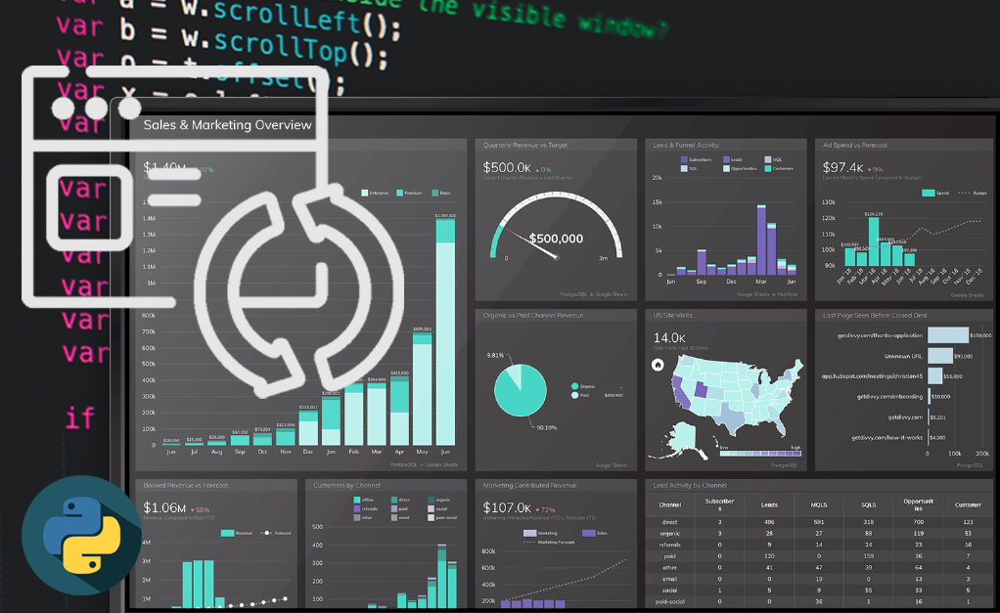
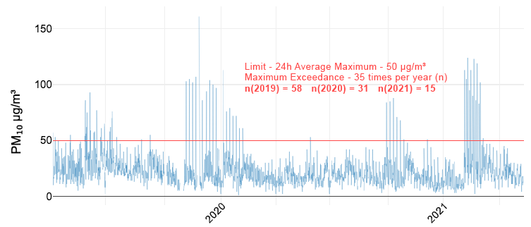
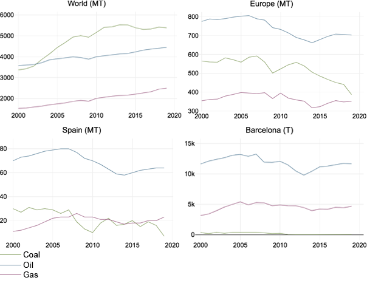

# Portfolio

---

## URL Refresher: ***Python script reloading every minute a specific URL***
During my period at Innovation Group, our team live production was broadcasted in 2 different TVs during the working hours. The main problem was that someone had to refresh the website every time we wanted to see updated data. As an IT assistant I came up with the idea of creating a python script to automated the process of open the url, log in and reload the website.

---

## Bachelor Thesis: ***Extensive green roofs as an air pollution abatement strategy in Barcelona***

This study encompasses published research to date on how green roofs can help mitigate pollution and quantifies the level of air pollution removal of extensive green roofs in two possible future scenarios in the Barcelona urban center. The focus was laid down on pollutants with health-threatening levels during the year 2020. A dry deposition model like the i-Tree Eco software was used to estimate how much pollution can be absorbed. This research suggests green roofs have the potential to play a key role in the development of sustainable cities, and as a result, they should be widely employed and promoted as instruments in urban planning and policies towards a climate friendly future.
  

**Figure 2.9.** PM10 24h average levels in Barcelona’s air measurement stations from April 2019 to April 2021

**Figure 1.2.** Fossil fuels consumption from 2000 to 2019 (MT: Megatonnes)

---
---
