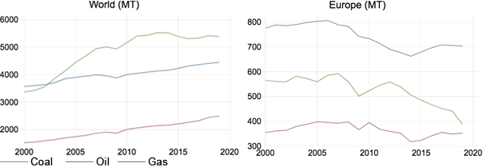

# Portfolio

---

## Bachelor Thesis: ***Extensive green roofs as an air pollution abatement strategy in Barcelona***

This study encompasses published research to date on how green roofs can help mitigate pollution and quantifies the level of air pollution removal of extensive green roofs in two possible future scenarios in the Barcelona urban center. The focus was laid down on pollutants with health-threatening levels during the year 2020. A dry deposition model like the i-Tree Eco software was used to estimate how much pollution can be absorbed. This research suggests green roofs have the potential to play a key role in the development of sustainable cities, and as a result, they should be widely employed and promoted as instruments in urban planning and policies towards a climate friendly future.

  

** Figure 2.9. ** PM10 24h average levels in Barcelona’s air measurement stations from April 2019 to April 2021

**Figure 1.2.** Fossil fuels consumption from 2000 to 2019 (MT: Megatonnes & T: Tonne)

**Figure 1.7.** CO2 Emissions from 2000 to 2019 & the 40% cut form 1990 levels (MT)

**Figure 2.8.** NO2 hourly maximum and monthly average levels in Barcelona’s air measurement stations from April 2019 to April 2021

  
**Figure 2.12.** Cost per square meter of each winning project in the 2017 competition and average cost per sqm

  
**Figure 3.2.** Comparison of annual concentration average and number of exceedances of PM10 for the studied scenarios during 2020

---
---
